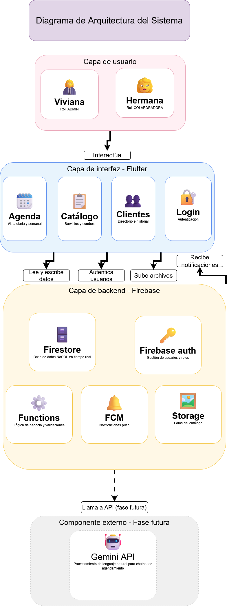

# 💄 Viviana Beauty Room — Sprint 1

> Taller de Full Stack · Solución Web Multiplataforma para Microempresa

---

## 1. Información General de la Microempresa

| Campo | Descripción |
|---|---|
| **Nombre** | Viviana Beauty Room |
| **Giro** | Estudio de belleza personal — maquillaje, peinado, diseño y depilación de cejas, extensiones de pestañas, lash lifting y planchado de cejas |
| **Público objetivo** | Mujeres de 20 a 50 años que trabajan o estudian, con poder adquisitivo medio-alto, que valoran la calidad y la atención personalizada |
| **Problema principal detectado** | La gestión del negocio depende completamente de la memoria de la propietaria y de herramientas dispersas (Google Calendar, hojas de papel, WhatsApp). No existe un sistema centralizado que soporte el crecimiento del negocio |
| **Necesidad digital identificada** | Una aplicación móvil que centralice el agendamiento de citas, muestre el catálogo de servicios con fotos y precios, y registre la información de las clientas |
| **Objetivo del sistema** | Desarrollar una aplicación multiplataforma (Flutter) que digitalice el flujo de agendamiento de citas, reemplace el catálogo enviado por mensaje y registre el directorio de clientas, reduciendo el tiempo operativo de la propietaria y profesionalizando la gestión del negocio |

---

## 2. Equipo de Desarrollo

| Integrante | Rol |
|---|---|
| Gabriel | Líder de equipo |
| Miguel | Desarrollador |
| José Luis | Desarrollador |
| Rocío | Desarrolladora |

---

## 3. Componentes UX/UI

### 🔗 Diseño en Figma
> https://www.figma.com/design/6GRxMzT1H4Dwjju0mw8vFR/Programaci%C3%B3nWeb?node-id=332-205&t=Gu2nfDKfKT2qASLv-1

### Wireframes de Baja Fidelidad
6 pantallas documentadas que cubren el flujo completo de la aplicación:

1. Login
2. Agenda
3. Nueva Cita (modal)
4. Catálogo de Servicios
5. Detalle de Cita
6. Directorio de Clientas

> Ver wireframes en Figma o consultar [`wireframe_simplificado.docx`](./wireframe_simplificado.docx)
> 

### Marca e Identidad Visual

**Paleta de colores**

| Color | HEX | Uso |
|---|---|---|
| Rosa principal | `#D4748F` | Acento, CTAs, íconos |
| Rosa claro | `#E8A0B4` | Fondos de secciones, estados activos |
| Blanco roto | `#FAF8F8` | Fondo principal de pantallas |
| Blanco puro | `#FFFFFF` | Tarjetas, modales |
| Negro | `#1A1A1A` | Tipografía principal |
| Gris oscuro | `#666666` | Texto secundario |
| Gris claro | `#CCCCCC` | Separadores, bordes |

**Tipografía**
- Títulos y nombre de marca: **Playfair Display**
- Cuerpo de texto y navegación: **Poppins**

> Consultar [`marca_viviana.docx`](./marca_viviana.docx.pdf) para el manual completo de estilo

### Style Tiles
Componentes UI validados: botones, formularios, tarjetas, iconografía y estados visuales (hover, activo, deshabilitado, error).

### Moodboard

### Mockups
Diseño de alta fidelidad en versión móvil y desktop para las 6 pantallas del MVP.

> Ver mockups en Figma — (https://www.figma.com/design/6GRxMzT1H4Dwjju0mw8vFR/Programaci%C3%B3nWeb?node-id=337-2&t=6dWFqC8jFz6VwX8y-1)

## 4. Componentes Técnicos

### Stack Tecnológico

| Capa | Tecnología | Uso |
|---|---|---|
| Interfaz | Flutter | App multiplataforma iOS y Android |
| Base de datos | Firebase Firestore | Base de datos NoSQL en tiempo real |
| Autenticación | Firebase Auth | Gestión de usuarios y roles |
| Lógica de negocio | Firebase Functions | Validaciones y reglas del sistema |
| Notificaciones | Firebase Cloud Messaging | Alertas y recordatorios push |
| Almacenamiento | Firebase Storage | Fotos del catálogo de servicios |
| IA (fase futura) | Gemini API | Chatbot de agendamiento por lenguaje natural |

### Diagrama de Arquitectura

### Diagrama de Base de Datos

> 

**Colecciones en Firestore**

| Colección | Campos principales |
|---|---|
| `citas` | idCita, clientaId, servicioId, fechaHora, duracion, estado, montoAnticipo, anticipoPagado, notas, creadaEn |
| `clientas` | idClienta, nombre, telefono, alergias, preferencias, notas, creadaEn |
| `servicios` | idServicio, nombre, descripcion, precio, duracionMin, fotoUrl, activo, proximamente, esCombo, serviciosIncluidos |
| `horariosBlockeados` | idHorario, fechaHora, duracionMin, motivo |
| `usuarios` | idUsuario, nombre, rol (ADMIN / COLABORADORA), email |

---

## 5. Documentación Técnica

| Documento | Descripción |
|---|---|
| [`sprint1_documentacion.docx`](./sprint1_documentacion.docx.pdf) | Información general, Look & Feel y Requerimientos Funcionales |
| [`wireframe_simplificado.docx`](./wireframe_simplificado.docx.pdf) | Transferencia de conocimiento sobre wireframe, stack técnico y modelo de datos |
| [`marca_viviana.docx`](./marca_viviana.docx.pdf) | Manual de marca e identidad visual |
| [`diagrama_arquitectura.png`](./diagrama_arquitectura.png) | Diagrama de arquitectura del sistema |

---

## 6. Requerimientos Funcionales — Resumen

| Módulo | Total RF | Prioridad |
|---|---|---|
| Gestión de Agenda | 7 | Alta |
| Gestión de Citas | 7 | Alta |
| Catálogo de Servicios | 6 | Alta |
| Directorio de Clientas | 6 | Media |
| Autenticación y Roles | 3 | Alta |

> Ver documento completo en [`sprint1_documentacion.docx`](./sprint1_documentacion.docx.pdf) — Sección 3

---

## 7. Alcance del MVP

**Incluido:**
- Agenda con vista diaria y semanal
- Bloqueo manual de horarios
- Nueva cita integrada en la agenda
- Catálogo con foto, descripción y precio
- Directorio de clientas con historial y notas

**Fuera del alcance (fase posterior):**
- Dashboard con métricas
- Reportes de ingresos
- Vista propia para la clienta
- Módulo de pagos y comprobantes
- Chatbot de agendamiento con Gemini API

---

*Taller de Full Stack · 2026*
