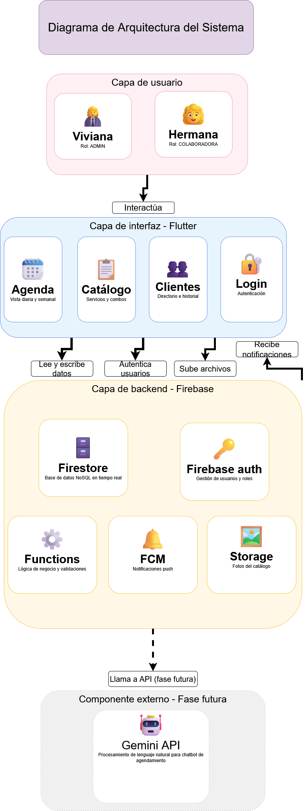
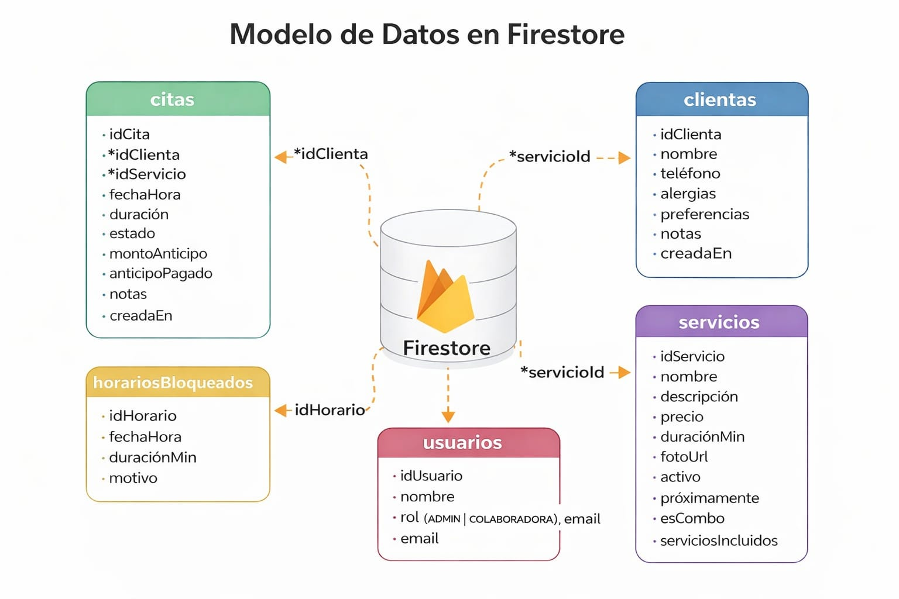

# 💄 Viviana Beauty Room — Sprint 1

> Taller de Full Stack · Solución Web Multiplataforma para Microempresa

---

## 1. Información General de la Microempresa

| Campo                              | Descripción                                                                                                                                                                                                                                                                        |
| ---------------------------------- | ---------------------------------------------------------------------------------------------------------------------------------------------------------------------------------------------------------------------------------------------------------------------------------- |
| **Nombre**                         | Viviana Beauty Room                                                                                                                                                                                                                                                                |
| **Giro**                           | Estudio de belleza personal — maquillaje, peinado, diseño y depilación de cejas, extensiones de pestañas, lash lifting y planchado de cejas                                                                                                                                        |
| **Público objetivo**               | Mujeres de 20 a 50 años que trabajan o estudian, con poder adquisitivo medio-alto, que valoran la calidad y la atención personalizada                                                                                                                                              |
| **Problema principal detectado**   | La gestión del negocio depende completamente de la memoria de la propietaria y de herramientas dispersas (Google Calendar, hojas de papel, WhatsApp). No existe un sistema centralizado que soporte el crecimiento del negocio                                                     |
| **Necesidad digital identificada** | Una aplicación móvil que centralice el agendamiento de citas, muestre el catálogo de servicios con fotos y precios, y registre la información de las clientas                                                                                                                      |
| **Objetivo del sistema**           | Desarrollar una aplicación multiplataforma (Flutter) que digitalice el flujo de agendamiento de citas, reemplace el catálogo enviado por mensaje y registre el directorio de clientas, reduciendo el tiempo operativo de la propietaria y profesionalizando la gestión del negocio |

---

## 2. Equipo de Desarrollo

| Integrante                     | Rol             |
| ------------------------------ | --------------- |
| Jeús Gabriel González Espinoza | Líder de equipo |
| Miguel Núñez Peña              | Desarrollador   |
| José Luis Martinez Rojas       | Desarrollador   |
| Rocío Vázquez Landaverde       | Desarrolladora  |

---

## 3. Componentes UX/UI

### 🔗 Diseño en Figma

> https://www.figma.com/design/6GRxMzT1H4Dwjju0mw8vFR/Programaci%C3%B3nWeb?node-id=332-205&t=Gu2nfDKfKT2qASLv-1

### Wireframes de Baja Fidelidad

6 pantallas documentadas que cubren el flujo completo de la aplicación:

1. Login
2. Agenda
3. Nueva Cita (modal)
4. Catálogo de Servicios
5. Detalle de Cita
6. Directorio de Clientas

> Ver wireframes en Figma o consultar [`wireframe_simplificado.docx`](./docs/wireframe_simplificado.docx.pdf)
> 
> 

### Marca e Identidad Visual

**Paleta de colores**

| Color          | HEX       | Uso                                  |
| -------------- | --------- | ------------------------------------ |
| Rosa principal | `#D4748F` | Acento, CTAs, íconos                 |
| Rosa claro     | `#E8A0B4` | Fondos de secciones, estados activos |
| Blanco roto    | `#FAF8F8` | Fondo principal de pantallas         |
| Blanco puro    | `#FFFFFF` | Tarjetas, modales                    |
| Negro          | `#1A1A1A` | Tipografía principal                 |
| Gris oscuro    | `#666666` | Texto secundario                     |
| Gris claro     | `#CCCCCC` | Separadores, bordes                  |

**Tipografía**

- Títulos y nombre de marca: **Playfair Display**
- Cuerpo de texto y navegación: **Poppins**

> Consultar [`marca_viviana.docx`](./docs/marca_viviana.docx.pdf) para el manual completo de estilo

### Style Tiles

Componentes UI validados: botones, formularios, tarjetas, iconografía y estados visuales (hover, activo, deshabilitado, error).


### Moodboard


### Mockups

Diseño de alta fidelidad en versión móvil y desktop para las 6 pantallas del MVP.

> Ver mockups en Figma — (https://www.figma.com/design/6GRxMzT1H4Dwjju0mw8vFR/Programaci%C3%B3nWeb?node-id=337-2&t=6dWFqC8jFz6VwX8y-1)
> 
> 

## 4. Componentes Técnicos

### Stack Tecnológico

| Capa              | Tecnología               | Uso                                          |
| ----------------- | ------------------------ | -------------------------------------------- |
| Interfaz          | Flutter                  | App multiplataforma iOS y Android            |
| Base de datos     | Firebase Firestore       | Base de datos NoSQL en tiempo real           |
| Autenticación     | Firebase Auth            | Gestión de usuarios y roles                  |
| Lógica de negocio | Firebase Functions       | Validaciones y reglas del sistema            |
| Notificaciones    | Firebase Cloud Messaging | Alertas y recordatorios push                 |
| Almacenamiento    | Firebase Storage         | Fotos del catálogo de servicios              |
| IA (fase futura)  | Gemini API               | Chatbot de agendamiento por lenguaje natural |

### Diagrama de Arquitectura



### Diagrama de Base de Datos



**Colecciones en Firestore**

| Colección            | Campos principales                                                                                               |
| -------------------- | ---------------------------------------------------------------------------------------------------------------- |
| `citas`              | idCita, clientaId, servicioId, fechaHora, duracion, estado, montoAnticipo, anticipoPagado, notas, creadaEn       |
| `clientas`           | idClienta, nombre, telefono, alergias, preferencias, notas, creadaEn                                             |
| `servicios`          | idServicio, nombre, descripcion, precio, duracionMin, fotoUrl, activo, proximamente, esCombo, serviciosIncluidos |
| `horariosBlockeados` | idHorario, fechaHora, duracionMin, motivo                                                                        |
| `usuarios`           | idUsuario, nombre, rol (ADMIN / COLABORADORA), email                                                             |

---

## 5. Documentación Técnica

| Documento                                                               | Descripción                                                                    |
| ----------------------------------------------------------------------- | ------------------------------------------------------------------------------ |
| [`sprint1_documentacion.docx`](./docs/sprint1_documentacion.docx.pdf)   | Información general, Look & Feel y Requerimientos Funcionales                  |
| [`wireframe_simplificado.docx`](./docs/wireframe_simplificado.docx.pdf) | Transferencia de conocimiento sobre wireframe, stack técnico y modelo de datos |
| [`marca_viviana.docx`](./docs/marca_viviana.docx.pdf)                   | Manual de marca e identidad visual                                             |
| [`diagrama_arquitectura.png`](./docs/diagrama_arquitectura.png)         | Diagrama de arquitectura del sistema                                           |

---

## 6. Requerimientos Funcionales — Resumen

| Módulo                 | Total RF | Prioridad |
| ---------------------- | -------- | --------- |
| Gestión de Agenda      | 7        | Alta      |
| Gestión de Citas       | 7        | Alta      |
| Catálogo de Servicios  | 6        | Alta      |
| Directorio de Clientas | 6        | Media     |
| Autenticación y Roles  | 3        | Alta      |

> Ver documento completo en [`sprint1_documentacion.docx`](./docs/sprint1_documentacion.docx.pdf) — Sección 3

---

## 7. Alcance del MVP

**Incluido:**

- Agenda con vista diaria y semanal
- Bloqueo manual de horarios
- Nueva cita integrada en la agenda
- Catálogo con foto, descripción y precio
- Directorio de clientas con historial y notas

**Fuera del alcance (fase posterior):**

- Dashboard con métricas
- Reportes de ingresos
- Vista propia para la clienta
- Módulo de pagos y comprobantes
- Chatbot de agendamiento con Gemini API

---

## 8. Avances del Proyecto — Sprint 2

### Arquitectura Flutter Implementada

Se estableció la estructura completa de la aplicación siguiendo las mejores prácticas de Flutter:

- **Organización de carpetas:**
  - `lib/core/` - Módulos centrales (router, theme)
  - `lib/features/` - Funcionalidades por dominio (auth, agenda, citas, servicios, clientes)
  - `lib/shared/` - Componentes y modelos reutilizables

- **Sistema de navegación:**
  - Implementación de Go Router para navegación declarativa
  - Configuración de rutas principales con deep links preparados

- **Gestión de estado:**
  - Arquitectura preparada para Riverpod (a implementar en próximos sprints)

### Componentes Reutilizables Desarrollados

Se crearon todos los componentes UI compartidos en `lib/shared/widgets/` siguiendo la identidad visual definida:

| Componente | Archivo | Descripción |
| ---------- | ------- | ----------- |
| `PrimaryButton` | `primary_button.dart` | Botón principal rosa (#D4748F) para CTAs |
| `SecondaryButton` | `secondary_button.dart` | Botón secundario con borde rosa |
| `AppBottomNavBar` | `app_bottom_nav_bar.dart` | Navegación inferior con 4 tabs (Agenda, Servicios, Clientes, Más) |
| `StatusBadge` | `status_badge.dart` | Badges de colores para estados de citas |
| `ClienteAvatar` | `cliente_avatar.dart` | Avatar circular con iniciales y fondo rosa claro |
| `SearchBarWidget` | `search_bar_widget.dart` | Barra de búsqueda con ícono de lupa |
| `FABButton` | `fab_button.dart` | Botón flotante '+' para nueva cita |
| `AppTextField` | `app_text_field.dart` | Campo de texto con validación y estilo consistente |

### Sistema de Temas

- **AppColors:** Paleta completa implementada en código Dart
- **AppTextStyles:** Estilos tipográficos con Playfair Display y Poppins
- **AppTheme:** Tema Material Design unificado

### Modelos de Datos

Implementación de modelos Dart para la estructura de datos:

- **Cita:** Modelo completo con estados (PENDIENTE, CONFIRMADA, CANCELADA, etc.)
- **Cliente:** Información de contacto, alergias y preferencias
- **Servicio:** Catálogo con precios, duración y combos

---

## 9. Avances del Proyecto — Sprint 3

### Pantallas Principales Implementadas

Se desarrollaron todas las pantallas del MVP con navegación completa:

- **Login Screen:** Autenticación con campos email/password y logo de marca
- **Agenda Screen:** Vista diaria/semanal de citas con tarjetas interactivas
- **Catálogo Screen:** Grid de servicios con filtros por categoría (Pestañas, Cejas, Maquillaje, Combos)
- **Directorio Screen:** Lista de clientas con búsqueda y avatar
- **Nueva Cita Modal:** Modal integrado en agenda para crear citas

### Integración de Features

- Merge exitoso de ramas de desarrollo (login, directorio, catálogo, nueva-cita)
- Navegación fluida entre todas las pantallas
- Aplicación de componentes compartidos en todas las interfaces

### Mejoras Técnicas

- Corrección de errores de navegación y tipos de datos
- Optimización de modales y comportamientos UI
- Preparación para integración con Firebase

### Estado Actual

La aplicación cuenta con:
- ✅ UI/UX consistente y profesional
- ✅ Navegación completa entre módulos
- ✅ Componentes reutilizables aplicados
- ✅ Arquitectura escalable preparada
- ✅ Modelos de datos estructurados

### Próximos Pasos (Sprint 4+)

- Integración completa con Firebase (Auth, Firestore, Storage)
- Implementación de reglas de negocio en Cloud Functions
- Validaciones de disponibilidad y anticipos
- Notificaciones push
- Dashboard con métricas financieras

---

## 10. Pruebas de Usuario

Para ver las pruebas de usuario realizadas durante el desarrollo, consulta el siguiente video: [https://youtu.be/yVC9rUf2TrI](https://youtu.be/yVC9rUf2TrI)

---

_Taller de Full Stack · 2026_

# 💄 Viviana Beauty Room — Sprint 2


# 💄 Viviana Beauty Room — Sprint 3


# 💄 Viviana Beauty Room — Sprint 4


# Tests Middleware Auth

```javascript
process.env.JWT_SECRET = 'test_secret';

const jwt = require('jsonwebtoken');
const authMiddleware = require('../../src/middleware/auth');

describe('Middleware: auth', () => {

  let req, res, next;

  beforeEach(() => {

    req = { headers: {} };

    res = {
      status: jest.fn().mockReturnThis(),
      json: jest.fn(),
    };

    next = jest.fn();

  });

  test('sin header Authorization → 401 Sin token', () => {

    authMiddleware(req, res, next);

    expect(res.status).toHaveBeenCalledWith(401);

    expect(res.json).toHaveBeenCalledWith({
      error: 'Sin token'
    });

    expect(next).not.toHaveBeenCalled();

  });

  test('header Authorization sin "Bearer" → 401 Sin token', () => {

    req.headers.authorization = 'TokenSinPrefijo';

    authMiddleware(req, res, next);

    expect(res.status).toHaveBeenCalledWith(401);

    expect(res.json).toHaveBeenCalledWith({
      error: 'Sin token'
    });

    expect(next).not.toHaveBeenCalled();

  });

  test('token válido → next() llamado y req.user establecido', () => {

    const payload = {
      idUsuario: 1,
      nombre: 'Viviana',
      rol: 'ADMIN',
      email: 'v@test.com'
    };

    const token = jwt.sign(
      payload,
      'test_secret'
    );

    req.headers.authorization = `Bearer ${token}`;

    authMiddleware(req, res, next);

    expect(next).toHaveBeenCalled();

    expect(req.user).toMatchObject(payload);

    expect(res.status).not.toHaveBeenCalled();

  });

  test('token con firma incorrecta → 401 Token inválido o expirado', () => {

    const token = jwt.sign(
      { idUsuario: 1 },
      'firma_incorrecta'
    );

    req.headers.authorization = `Bearer ${token}`;

    authMiddleware(req, res, next);

    expect(res.status).toHaveBeenCalledWith(401);

    expect(res.json).toHaveBeenCalledWith({
      error: 'Token inválido o expirado'
    });

    expect(next).not.toHaveBeenCalled();

  });

  test('token expirado → 401 Token inválido o expirado', () => {

    const token = jwt.sign(
      { idUsuario: 1 },
      'test_secret',
      { expiresIn: -1 }
    );

    req.headers.authorization = `Bearer ${token}`;

    authMiddleware(req, res, next);

    expect(res.status).toHaveBeenCalledWith(401);

    expect(res.json).toHaveBeenCalledWith({
      error: 'Token inválido o expirado'
    });

    expect(next).not.toHaveBeenCalled();

  });

  test('token malformado (string basura) → 401 Token inválido o expirado', () => {

    req.headers.authorization =
      'Bearer esto.no.es.un.jwt';

    authMiddleware(req, res, next);

    expect(res.status).toHaveBeenCalledWith(401);

    expect(res.json).toHaveBeenCalledWith({
      error: 'Token inválido o expirado'
    });

    expect(next).not.toHaveBeenCalled();

  });

});
```

# Explicación del código de pruebas del middleware JWT

Este código es un conjunto de pruebas unitarias realizado con Jest para validar el funcionamiento de un middleware de autenticación JWT en un backend desarrollado con Express.js. El objetivo principal es comprobar que el middleware maneje correctamente distintos escenarios relacionados con la autenticación mediante tokens JWT, permitiendo el acceso únicamente a usuarios autenticados y rechazando solicitudes inválidas o maliciosas.

---

## Configuración inicial

Al inicio del código se define la variable de entorno:

```javascript
process.env.JWT_SECRET = 'test_secret';
```

Esta clave secreta se utiliza para firmar y verificar los tokens JWT durante las pruebas.

Posteriormente se importan dos módulos:

```javascript
const jwt = require('jsonwebtoken');
const authMiddleware = require('../../src/middleware/auth');
```

- `jsonwebtoken`: librería usada para crear y validar tokens JWT.
- `authMiddleware`: middleware que se desea probar.

---

## Bloque describe()

```javascript
describe('Middleware: auth', () => {
```

La función `describe()` agrupa todas las pruebas relacionadas con el middleware de autenticación.

---

## Variables simuladas

```javascript
let req, res, next;
```

Estas variables simulan los objetos de Express:

| Variable | Función |
|---|---|
| `req` | Representa la petición HTTP |
| `res` | Representa la respuesta del servidor |
| `next` | Continúa al siguiente middleware |

---

## beforeEach()

```javascript
beforeEach(() => {
```

Se ejecuta antes de cada prueba para reinicializar los objetos simulados y asegurar que cada test empiece limpio.

### Simulación de req

```javascript
req = { headers: {} };
```

Simula una petición HTTP con headers vacíos.

### Simulación de res

```javascript
res = {
  status: jest.fn().mockReturnThis(),
  json: jest.fn(),
};
```

- `jest.fn()` crea funciones simuladas.
- `mockReturnThis()` permite encadenar:

```javascript
res.status(401).json(...)
```

### Simulación de next

```javascript
next = jest.fn();
```

Permite verificar si el middleware continúa correctamente.

---

# Pruebas realizadas

---

## 1. Sin header Authorization

```javascript
test('sin header Authorization → 401 Sin token'
```

Esta prueba verifica que si no existe el header `Authorization`, el middleware debe responder:

```javascript
401
{ error: 'Sin token' }
```

También se valida que `next()` no haya sido llamado.

---

## 2. Header sin Bearer

```javascript
req.headers.authorization = 'TokenSinPrefijo';
```

El middleware espera el formato:

```http
Authorization: Bearer TOKEN
```

Como el formato es incorrecto, debe responder:

```javascript
401
{ error: 'Sin token' }
```

---

## 3. Token válido

### Payload

```javascript
const payload = {
  idUsuario: 1,
  nombre: 'Viviana',
  rol: 'ADMIN',
  email: 'v@test.com'
};
```

Se crea información del usuario para incluirla dentro del JWT.

### Generación del token

```javascript
const token = jwt.sign(payload, 'test_secret');
```

Se genera un token válido usando la clave secreta.

### Authorization header

```javascript
req.headers.authorization = `Bearer ${token}`;
```

Se simula una petición autenticada.

### Verificaciones

```javascript
expect(next).toHaveBeenCalled();
```

Comprueba que el middleware permitió el acceso.

```javascript
expect(req.user).toMatchObject(payload);
```

Verifica que el usuario autenticado se guardó en:

```javascript
req.user
```

---

## 4. Token con firma incorrecta

```javascript
jwt.sign({ idUsuario: 1 }, 'firma_incorrecta');
```

El token fue firmado con otra clave distinta a `JWT_SECRET`.

El middleware debe rechazarlo devolviendo:

```javascript
401
{ error: 'Token inválido o expirado' }
```

---

## 5. Token expirado

```javascript
{ expiresIn: -1 }
```

Se crea un token ya expirado.

El middleware debe detectar esta condición y responder:

```javascript
401
{ error: 'Token inválido o expirado' }
```

---

## 6. Token malformado

```javascript
'Bearer esto.no.es.un.jwt'
```

Se envía una cadena inválida que no corresponde a un JWT real.

El middleware debe manejar el error correctamente sin romper la aplicación y responder:

```javascript
401
{ error: 'Token inválido o expirado' }
```

---

# Flujo del middleware

```plaintext
Request
 ↓
Authorization Header
 ↓
JWT Verify
 ↓
¿válido?
 ├── Sí → next()
 └── No → 401
```

---

# Conclusión

Este archivo de pruebas garantiza que el middleware JWT funcione correctamente bajo diferentes condiciones, tanto válidas como inválidas. Además, demuestra buenas prácticas de testing como el uso de mocks, pruebas unitarias aisladas y validación de escenarios positivos y negativos.

Gracias a estas pruebas es posible asegurar que:

- solo usuarios autenticados accedan a rutas protegidas,
- los tokens inválidos sean rechazados,
- los tokens expirados no puedan reutilizarse,
- y la API mantenga un comportamiento seguro y estable.

# Tests Agenda

```js
jest.mock('../../src/db/schema', () => ({ prepare: jest.fn() }));
jest.mock('../../src/services/googleCalendar.service', () => ({
  createEvent: jest.fn(),
  updateEvent: jest.fn(),
  deleteEvent: jest.fn(),
}));

const db   = require('../../src/db/schema');
const gcal = require('../../src/services/googleCalendar.service');
const ctrl = require('../../src/routes/agenda.controller');
```

---

<details>
<summary>Setup general</summary>

```js
describe('Agenda Controller', () => {
  let req, res;

  beforeEach(() => {
    req = { body: {}, query: {}, params: {} };
    res = {
      status: jest.fn().mockReturnThis(),
      json: jest.fn(),
    };
    jest.clearAllMocks();
  });
});
```

</details>

---

<details>
<summary>crearCita</summary>

```js
describe('crearCita', () => {
  test('sin campos obligatorios → 400', async () => {
    req.body = {};
    await ctrl.crearCita(req, res);

    expect(res.status).toHaveBeenCalledWith(400);
    expect(res.json).toHaveBeenCalledWith({
      error: 'Faltan campos obligatorios'
    });
  });

  test('sin idServicio → 400', async () => {
    req.body = {
      fechaHora: '2026-05-11T10:00:00',
      duracion: 60
    };

    await ctrl.crearCita(req, res);

    expect(res.status).toHaveBeenCalledWith(400);
  });

  test('sin fechaHora → 400', async () => {
    req.body = {
      idServicio: 1,
      duracion: 60
    };

    await ctrl.crearCita(req, res);

    expect(res.status).toHaveBeenCalledWith(400);
  });

  test('campos válidos → 201 y crea evento en Google Calendar', async () => {
    req.body = {
      idServicio: 1,
      fechaHora: '2026-05-11T10:00:00',
      duracion: 60,
      idClienta: 2
    };

    db.prepare
      .mockReturnValueOnce({
        run: jest.fn().mockReturnValue({
          lastInsertRowid: 10
        })
      })
      .mockReturnValueOnce({
        get: jest.fn().mockReturnValue({
          idCita: 10
        })
      })
      .mockReturnValueOnce({
        get: jest.fn().mockReturnValue({
          nombre: 'Manicura'
        })
      })
      .mockReturnValueOnce({
        get: jest.fn().mockReturnValue({
          nombre: 'Viviana'
        })
      })
      .mockReturnValueOnce({
        run: jest.fn()
      });

    gcal.createEvent.mockResolvedValue('gc-event-123');

    await ctrl.crearCita(req, res);

    expect(res.status).toHaveBeenCalledWith(201);
    expect(gcal.createEvent).toHaveBeenCalled();
  });
});
```

</details>

---

<details>
<summary>obtenerCitasPorDia</summary>

```js
describe('obtenerCitasPorDia', () => {
  test('sin parámetro fecha → 400', () => {
    req.query = {};

    ctrl.obtenerCitasPorDia(req, res);

    expect(res.status).toHaveBeenCalledWith(400);

    expect(res.json).toHaveBeenCalledWith({
      error: 'Parámetro "fecha" requerido en formato YYYY-MM-DD',
    });
  });

  test('fecha con formato inválido (DD-MM-YYYY) → 400', () => {
    req.query = { fecha: '11-05-2026' };

    ctrl.obtenerCitasPorDia(req, res);

    expect(res.status).toHaveBeenCalledWith(400);

    expect(res.json).toHaveBeenCalledWith({
      error: 'Formato de fecha inválido. Use YYYY-MM-DD',
    });
  });

  test('fecha válida YYYY-MM-DD → retorna citas', () => {
    req.query = { fecha: '2026-05-11' };

    db.prepare.mockReturnValue({
      all: jest.fn().mockReturnValue([
        { idCita: 1 },
        { idCita: 2 }
      ])
    });

    ctrl.obtenerCitasPorDia(req, res);

    expect(res.json).toHaveBeenCalledWith([
      { idCita: 1 },
      { idCita: 2 }
    ]);
  });
});
```

</details>

---

<details>
<summary>obtenerCitasSemana</summary>

```js
describe('obtenerCitasSemana', () => {
  test('sin parámetro inicio → 400', () => {
    req.query = {};

    ctrl.obtenerCitasSemana(req, res);

    expect(res.status).toHaveBeenCalledWith(400);
  });

  test('fecha inválida → 400', () => {
    req.query = { inicio: 'no-es-fecha' };

    ctrl.obtenerCitasSemana(req, res);

    expect(res.status).toHaveBeenCalledWith(400);
  });

  test('fecha válida → retorna citas del rango de 7 días', () => {
    req.query = { inicio: '2026-05-11' };

    db.prepare.mockReturnValue({
      all: jest.fn().mockReturnValue([
        { idCita: 3 }
      ])
    });

    ctrl.obtenerCitasSemana(req, res);

    expect(res.json).toHaveBeenCalledWith([
      { idCita: 3 }
    ]);
  });
});
```

</details>

---

<details>
<summary>editarCitaPorId</summary>

```js
describe('editarCitaPorId', () => {
  test('sin campos para actualizar → 400', async () => {
    req.params = { id: '1' };
    req.body = {};

    await ctrl.editarCitaPorId(req, res);

    expect(res.status).toHaveBeenCalledWith(400);

    expect(res.json).toHaveBeenCalledWith({
      error: 'No hay campos para actualizar'
    });
  });

  test('con estado válido → actualiza y responde 200', async () => {
    req.params = { id: '1' };
    req.body = { estado: 'COMPLETADA' };

    const citaAntes = {
      idCita: 1,
      estado: 'PENDIENTE',
      idServicio: 1,
      idClienta: 1,
      googleCalendarEventId: 'gc-123'
    };

    const citaDespues = {
      ...citaAntes,
      estado: 'COMPLETADA'
    };

    db.prepare
      .mockReturnValueOnce({
        get: jest.fn().mockReturnValue(citaAntes)
      })
      .mockReturnValueOnce({
        run: jest.fn().mockReturnValue({
          changes: 1
        })
      })
      .mockReturnValueOnce({
        get: jest.fn().mockReturnValue(citaDespues)
      })
      .mockReturnValueOnce({
        get: jest.fn().mockReturnValue({
          nombre: 'Manicura'
        })
      })
      .mockReturnValueOnce({
        get: jest.fn().mockReturnValue({
          nombre: 'Viviana'
        })
      });

    gcal.updateEvent.mockResolvedValue();

    await ctrl.editarCitaPorId(req, res);

    expect(res.json).toHaveBeenCalledWith({
      mensaje: 'Cita actualizada correctamente'
    });

    expect(gcal.updateEvent).toHaveBeenCalledWith(
      'gc-123',
      citaDespues,
      'Manicura',
      'Viviana'
    );
  });
});
```

</details>

---

<details>
<summary>cancelarCitaPorId</summary>

```js
describe('cancelarCitaPorId', () => {
  test('cita no encontrada → 404', async () => {
    req.params = { id: '999' };

    db.prepare
      .mockReturnValueOnce({
        get: jest.fn().mockReturnValue(null)
      })
      .mockReturnValueOnce({
        run: jest.fn().mockReturnValue({
          changes: 0
        })
      });

    await ctrl.cancelarCitaPorId(req, res);

    expect(res.status).toHaveBeenCalledWith(404);

    expect(res.json).toHaveBeenCalledWith({
      error: 'Cita no encontrada'
    });
  });

  test('cita con evento en Google Calendar → deleteEvent llamado', async () => {
    req.params = { id: '1' };

    db.prepare
      .mockReturnValueOnce({
        get: jest.fn().mockReturnValue({
          googleCalendarEventId: 'gc-abc'
        })
      })
      .mockReturnValueOnce({
        run: jest.fn().mockReturnValue({
          changes: 1
        })
      });

    gcal.deleteEvent.mockResolvedValue();

    await ctrl.cancelarCitaPorId(req, res);

    expect(gcal.deleteEvent).toHaveBeenCalledWith('gc-abc');

    expect(res.json).toHaveBeenCalledWith({
      mensaje: 'Cita cancelada correctamente'
    });
  });

  test('cita sin evento en Google Calendar → no llama deleteEvent', async () => {
    req.params = { id: '2' };

    db.prepare
      .mockReturnValueOnce({
        get: jest.fn().mockReturnValue({
          googleCalendarEventId: null
        })
      })
      .mockReturnValueOnce({
        run: jest.fn().mockReturnValue({
          changes: 1
        })
      });

    await ctrl.cancelarCitaPorId(req, res);

    expect(gcal.deleteEvent).not.toHaveBeenCalled();

    expect(res.json).toHaveBeenCalledWith({
      mensaje: 'Cita cancelada correctamente'
    });
  });
});
```

</details>

# Documentación de pruebas — Agenda Controller

Este archivo contiene pruebas unitarias realizadas con **Jest** para validar el comportamiento del controlador `agenda.controller`.

Las pruebas verifican:

- Validaciones de entrada.
- Respuestas HTTP esperadas.
- Integración con Google Calendar.
- Operaciones sobre la base de datos.
- Manejo de errores y casos límite.

---

# Mocks utilizados

Antes de ejecutar las pruebas se mockean los módulos externos para evitar dependencias reales.

```js
jest.mock('../../src/db/schema', () => ({ prepare: jest.fn() }));
jest.mock('../../src/services/googleCalendar.service', () => ({
  createEvent: jest.fn(),
  updateEvent: jest.fn(),
  deleteEvent: jest.fn(),
}));
```

## Objetivo

- Simular la base de datos.
- Evitar llamadas reales a Google Calendar.
- Controlar los valores retornados durante cada prueba.

---

# Configuración inicial

En cada prueba se reinician los objetos `req` y `res`.

```js
beforeEach(() => {
  req = { body: {}, query: {}, params: {} };

  res = {
    status: jest.fn().mockReturnThis(),
    json: jest.fn(),
  };

  jest.clearAllMocks();
});
```

## Explicación

- `req` simula una petición HTTP.
- `res` simula una respuesta Express.
- `status()` retorna `this` para permitir encadenamiento.
- `clearAllMocks()` limpia llamadas anteriores.

---

# Pruebas de `crearCita`

Estas pruebas validan la creación de citas.

---

## Validación de campos obligatorios

```js
req.body = {};
```

Se verifica que:

- Si faltan datos obligatorios:
  - El controlador responda `400`.
  - Se envíe un mensaje de error.

---

## Validación de `idServicio`

```js
req.body = {
  fechaHora: '2026-05-11T10:00:00',
  duracion: 60
};
```

Se prueba que:

- Una cita sin `idServicio`
- Sea rechazada con estado `400`.

---

## Validación de `fechaHora`

```js
req.body = {
  idServicio: 1,
  duracion: 60
};
```

Se verifica que:

- Una cita sin fecha
- No pueda ser creada.

---

## Creación exitosa de cita

```js
gcal.createEvent.mockResolvedValue('gc-event-123');
```

La prueba valida:

- Inserción en base de datos.
- Creación del evento en Google Calendar.
- Respuesta HTTP `201`.

También se simulan:

- Servicio consultado.
- Nombre de clienta.
- ID generado por SQLite.

---

# Pruebas de `obtenerCitasPorDia`

Estas pruebas validan la obtención de citas por fecha.

---

## Fecha faltante

```js
req.query = {};
```

Se espera:

- Código `400`.
- Mensaje indicando que la fecha es obligatoria.

---

## Formato inválido

```js
req.query = { fecha: '11-05-2026' };
```

Se verifica que:

- Solo se acepte formato `YYYY-MM-DD`.

---

## Texto inválido

```js
req.query = { fecha: 'hoy' };
```

Se prueba que:

- Valores no válidos generen error `400`.

---

## Consulta exitosa

```js
db.prepare.mockReturnValue({
  all: jest.fn().mockReturnValue([
    { idCita: 1 },
    { idCita: 2 }
  ])
});
```

La prueba verifica:

- Consulta correcta a la base de datos.
- Retorno de citas encontradas.

---

# Pruebas de `obtenerCitasSemana`

Estas pruebas validan la consulta semanal de citas.

---

## Inicio faltante

```js
req.query = {};
```

Se espera:

- Error `400`.

---

## Fecha inválida

```js
req.query = { inicio: 'no-es-fecha' };
```

Se valida:

- Rechazo de formatos inválidos.

---

## Consulta semanal exitosa

```js
req.query = { inicio: '2026-05-11' };
```

Se prueba:

- Obtención de citas dentro del rango de 7 días.

---

# Pruebas de `editarCitaPorId`

Estas pruebas verifican la actualización de citas.

---

## Sin datos para actualizar

```js
req.body = {};
```

Se valida:

- Que no se permita actualizar sin campos.
- Retorno de error `400`.

---

## Actualización exitosa

```js
req.body = {
  estado: 'COMPLETADA'
};
```

La prueba valida:

- Obtención de la cita original.
- Actualización en base de datos.
- Sincronización con Google Calendar.
- Respuesta exitosa.

También se comprueba:

```js
expect(gcal.updateEvent).toHaveBeenCalledWith(
  'gc-123',
  citaDespues,
  'Manicura',
  'Viviana'
);
```

Esto garantiza:

- Que el evento de Google Calendar se actualice correctamente.

---

# Pruebas de `cancelarCitaPorId`

Estas pruebas validan la cancelación de citas.

---

## Cita inexistente

```js
req.params = { id: '999' };
```

Se espera:

- Error `404`.
- Mensaje `"Cita no encontrada"`.

---

## Cancelación con evento en Google Calendar

```js
googleCalendarEventId: 'gc-abc'
```

La prueba verifica:

- Eliminación del evento en Google Calendar.
- Actualización de la cita en base de datos.
- Respuesta exitosa.

---

## Cancelación sin evento asociado

```js
googleCalendarEventId: null
```

Se comprueba:

- Que NO se llame `deleteEvent`.
- La cancelación siga funcionando correctamente.

---

# Conclusión

Estas pruebas aseguran que el controlador:

- Valide correctamente los datos.
- Responda con códigos HTTP apropiados.
- Interactúe correctamente con SQLite.
- Mantenga sincronización con Google Calendar.
- Maneje errores y casos especiales de manera segura.

El uso de mocks permite:

- Ejecutar pruebas rápidas.
- Evitar dependencias externas.
- Garantizar aislamiento entre casos de prueba.


---
# Tests — AuthProvider FLUTTER

Este archivo contiene pruebas unitarias para `AuthProvider` usando:

- `flutter_test`
- `mockito`

Las pruebas verifican:

- Restauración de sesión.
- Inicio de sesión.
- Cierre de sesión.
- Manejo de errores.
- Persistencia de token y usuario.

---

# Importaciones principales

```dart
import 'package:flutter_test/flutter_test.dart';
import 'package:mockito/annotations.dart';
import 'package:mockito/mockito.dart';
```

## Objetivo

Estas librerías permiten:

- Crear pruebas unitarias.
- Simular dependencias.
- Verificar llamadas y comportamientos.

---

# Generación de mocks

```dart
@GenerateMocks([ApiClient, TokenStorageService])
```

## Explicación

Mockito genera automáticamente clases mock para:

- `ApiClient`
- `TokenStorageService`

Esto permite:

- Evitar llamadas reales a APIs.
- Simular almacenamiento seguro.
- Controlar respuestas durante las pruebas.

---

# Variables utilizadas

```dart
late MockApiClient mockApiClient;
late MockTokenStorageService mockTokenStorage;
late AuthProvider authProvider;
```

## Explicación

### `mockApiClient`

Simula las peticiones HTTP al backend.

### `mockTokenStorage`

Simula el almacenamiento local de tokens y usuario.

### `authProvider`

Instancia real del provider bajo prueba.

---

# Configuración inicial

```dart
setUp(() {
  mockApiClient = MockApiClient();
  mockTokenStorage = MockTokenStorageService();

  authProvider = AuthProvider(
    apiClient: mockApiClient,
    tokenStorage: mockTokenStorage,
  );
});
```

## Objetivo

Antes de cada prueba:

- Se crean nuevos mocks.
- Se reinicia el estado del provider.
- Se evita contaminación entre tests.

---

# Pruebas de `restoreSession`

Estas pruebas validan la restauración automática de sesión.

---

## Sin token guardado

```dart
when(mockTokenStorage.readToken())
    .thenAnswer((_) async => null);
```

## Se verifica

- Estado `unauthenticated`.
- Usuario nulo.
- Token nulo.

Esto garantiza:

- Que no se restaure sesión inexistente.

---

## Token válido y backend responde correctamente

```dart
when(mockApiClient.getMe())
```

La prueba valida:

- Recuperación del usuario.
- Restauración del token.
- Cambio de estado a `authenticated`.

También se verifica:

```dart
expect(authProvider.usuario?.nombre, 'Viviana');
```

---

## Token expirado

```dart
'statusCode': 401
```

Se comprueba que:

- Se eliminen los datos locales.
- se limpie la sesión.
- el estado cambie a `unauthenticated`.

Además:

```dart
verify(mockTokenStorage.clearAll()).called(1);
```

Garantiza que:

- el almacenamiento haya sido limpiado correctamente.

---

# Pruebas de `signIn`

Estas pruebas validan el proceso de autenticación.

---

## Credenciales válidas

```dart
when(mockApiClient.login(...))
```

La prueba verifica:

- Inicio de sesión exitoso.
- Guardado del token.
- Persistencia del usuario.
- Cambio de estado a `authenticated`.

También se valida:

```dart
verify(mockTokenStorage.saveToken('jwt-token')).called(1);
```

---

## Credenciales incorrectas

```dart
'error': 'Credenciales incorrectas'
```

Se comprueba:

- Retorno `false`.
- Estado `error`.
- Mensaje de error mostrado correctamente.

---

## Error de conexión con API

```dart
.thenThrow(Exception('Connection refused'));
```

La prueba verifica:

- Manejo de excepciones.
- Mensaje amigable para el usuario.

Resultado esperado:

```dart
'Servicio no disponible. Inténtalo más tarde.'
```

---

# Pruebas de `signOut`

Estas pruebas validan el cierre de sesión.

---

## Cierre exitoso

```dart
await authProvider.signOut();
```

Se verifica:

- Eliminación del token.
- Eliminación del usuario.
- Limpieza de errores.
- Cambio de estado a `unauthenticated`.

Además:

```dart
verify(mockTokenStorage.clearAll()).called(1);
```

Garantiza que:

- el almacenamiento local fue limpiado correctamente.

---

# Estados utilizados

El provider maneja distintos estados de autenticación:

| Estado | Descripción |
|---|---|
| `AuthState.authenticated` | Usuario autenticado |
| `AuthState.unauthenticated` | Usuario sin sesión |
| `AuthState.error` | Ocurrió un error |

---

# Funciones mockeadas

## ApiClient

| Método | Función |
|---|---|
| `login()` | Autenticar usuario |
| `getMe()` | Obtener usuario actual |

---

## TokenStorageService

| Método | Función |
|---|---|
| `readToken()` | Leer token guardado |
| `saveToken()` | Guardar token |
| `saveUser()` | Guardar usuario |
| `clearAll()` | Limpiar almacenamiento |

---

# Conclusión

Estas pruebas aseguran que `AuthProvider`:

- Maneje correctamente autenticación.
- Restaure sesiones persistentes.
- Controle errores de API.
- Mantenga sincronización con almacenamiento local.
- Limpie correctamente la sesión.

El uso de mocks permite:

- Pruebas rápidas.
- Aislamiento de dependencias.
- Simulación de distintos escenarios.
- Mayor confiabilidad del sistema de autenticación.

#Evidencias


# 💄 Viviana Beauty Room — Sprint 5


